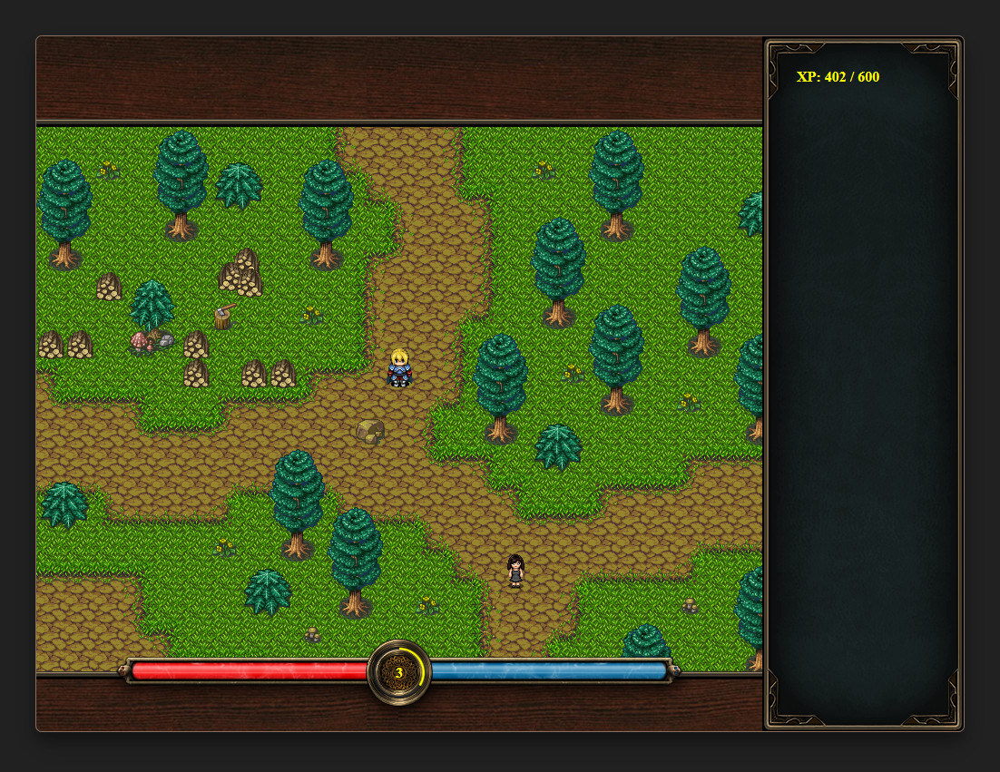

# Phaser RPG
This is a minimal engine/template for a browser-based 2D RPG that I've written for fun while learning [Phaser](https://phaser.io/). Probably it can be useful for building a client for a full-featured game, feel free to use it in your project.

You can try it online at [https://gecko0307.github.io/phaser-rpg](https://gecko0307.github.io/phaser-rpg/).

Implemented features:
* Character animation
* Grid-based point-and-click movement using [EasyStar](https://www.easystarjs.com/) pathfinding library
* Tile-based maps using [Tiled](https://www.mapeditor.org) for an editor
* Basic GUI and an unfinished dialog system

